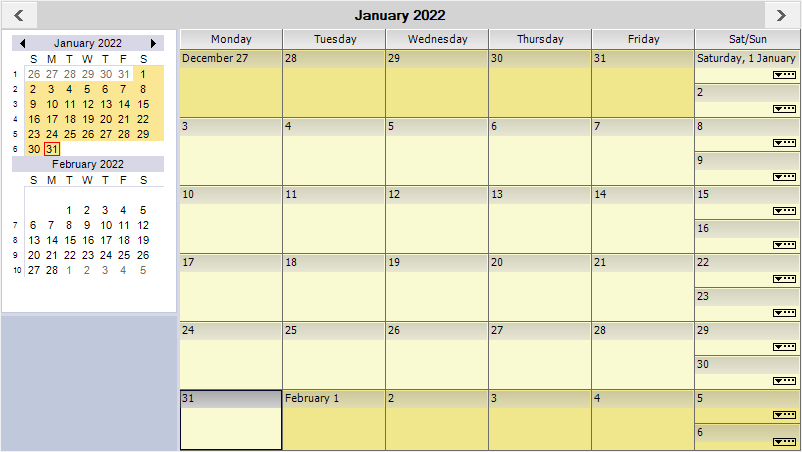

# WinForms Scheduler Getting Started

The [WinForms Scheduler](https://www.syncfusion.com/winforms-ui-controls/scheduler?utm_source=github&utm_medium=listing&utm_campaign=winforms-scheduler-github-samples) control (Event Calendar) allows users to schedule and manage appointments through an intuitive user interface. It has different view modes such as day, week, work week, and month view to display appointments in. It also provides support to drag and drop an appointment from one time slot to another time slot. Its rich feature set includes recurring appointments, appointment drag and drop, appearance customization, globalization and localization and more.

Take a moment to peruse the [WinForms Scheduler documentation](https://help.syncfusion.com/windowsforms/scheduler/overview?utm_source=github&utm_medium=listing&utm_campaign=winforms-scheduler-github-samples), where you can find about Scheduler with code examples.

## Features and benefits

### Microsoft Outlook Calendar-like User Interface
The Scheduler for Windows Forms has day, week, work week, month, and custom [views](https://help.syncfusion.com/windowsforms/scheduler/getting-started#changing-views?utm_source=github&utm_medium=listing&utm_campaign=winforms-scheduler-github-samples), similar to Outlook. It is used to [create appointments](https://help.syncfusion.com/windowsforms/scheduler/getting-started#schedule-appointment?utm_source=github&utm_medium=listing&utm_campaign=winforms-scheduler-github-samples) and events, organize meetings, view group schedules, and much more. 

### Rich User Experience
The user interface is very interactive and lets users perform operations like [creating](https://help.syncfusion.com/windowsforms/scheduler/getting-started#insert?utm_source=github&utm_medium=listing&utm_campaign=winforms-scheduler-github-samples), [editing](https://help.syncfusion.com/windowsforms/scheduler/getting-started#modify?utm_source=github&utm_medium=listing&utm_campaign=winforms-scheduler-github-samples), and rescheduling appointments. Set appointment reminders to notify upcoming appointments.  

### Highly Customizable
The WinForms Scheduler can easily be customized based on the requirement. Time intervals for appointments can also be customized. Provide a unique and consistent look to your scheduler with [appearance customization](https://help.syncfusion.com/windowsforms/scheduler/customizing-appearance?utm_source=github&utm_medium=listing&utm_campaign=winforms-scheduler-github-samples) using styles, data templates, and themes.

### Recurrence Patterns
Specify daily, weekly, monthly, and yearly recurrence patterns for appointments.

### High-Performance
The feature-rich WinForms Scheduler can easily handle a large number of appointments. 

### Localization
All visible strings in the user interface can be localized to any desired language.

### Themes
The WinForms Scheduler control comes with a large number of themes to quickly create elegant interfaces that look and feel like Windows, Office, Outlook, and other popular platforms.

## Related links
[Learn More about WinForms Schedule Control](https://www.syncfusion.com/winforms-ui-controls/scheduler?utm_source=github&utm_medium=listing&utm_campaign=winforms-scheduler-github-samples)

[Documentation](https://help.syncfusion.com/windowsforms/schedule/overview?utm_source=github&utm_medium=listing&utm_campaign=winforms-scheduler-github-samples)

[Release History](https://help.syncfusion.com/windowsforms/release-notes/v19.4.0.43?utm_source=github&utm_medium=listing&utm_campaign=winforms-scheduler-github-samples)

[Online Demos](https://github.com/syncfusion/winforms-demos/?utm_source=github&utm_medium=listing&utm_campaign=winforms-scheduler-github-samples)

[Contact Support](https://www.syncfusion.com/support/directtrac/incidents/newincident/?utm_source=github&utm_medium=listing&utm_campaign=winforms-scheduler-github-samples)

[Suggest a feature or report a bug](https://www.syncfusion.com/feedback/winforms?utm_source=github&utm_medium=listing&utm_campaign=winforms-scheduler-github-samples)

[Pricing](https://www.syncfusion.com/sales/products/windowsforms?utm_source=github&utm_medium=listing&utm_campaign=winforms-scheduler-github-samples)

## About Syncfusion WinForms UI Controls
Syncfusion's [WinForms UI Controls](https://www.syncfusion.com/winforms-ui-controls?utm_source=github&utm_medium=listing&utm_campaign=winforms-scheduler-github-samples) library is the only suite that you will ever need to build an application since it contains over 100 high-performance, lightweight, modular, and responsive UI Controls in a single package. In addition to Scheduler, we provide popular WinForms Controls such as [DataGrid](https://www.syncfusion.com/winforms-ui-controls/datagrid?utm_source=github&utm_medium=listing&utm_campaign=winforms-scheduler-github-samples), [Charts](https://www.syncfusion.com/winforms-ui-controls/chart?utm_source=github&utm_medium=listing&utm_campaign=winforms-scheduler-github-samples), [Diagram](https://www.syncfusion.com/winforms-ui-controls/diagram?utm_source=github&utm_medium=listing&utm_campaign=winforms-scheduler-github-samples), and [Syntax editor](https://www.syncfusion.com/winforms-ui-controls/syntax-editor?utm_source=github&utm_medium=listing&utm_campaign=winforms-scheduler-github-samples).

## About Syncfusion
Founded in 2001 and headquartered in Research Triangle Park, N.C., Syncfusion has more than 26,000+ customers and more than 1 million users, including large financial institutions, Fortune 500 companies, and global IT consultancies.

Today, we provide 1700+ components and frameworks for web ([Blazor](https://www.syncfusion.com/blazor-components?utm_source=github&utm_medium=listing&utm_campaign=winforms-scheduler-github-samples), [ASP.NET Core](https://www.syncfusion.com/aspnet-core-ui-controls?utm_source=github&utm_medium=listing&utm_campaign=winforms-scheduler-github-samples), [ASP.NET MVC](https://www.syncfusion.com/aspnet-mvc-ui-controls?utm_source=github&utm_medium=listing&utm_campaign=winforms-scheduler-github-samples), [ASP.NET WebForms](https://www.syncfusion.com/jquery/aspnet-webforms-ui-controls?utm_source=github&utm_medium=listing&utm_campaign=winforms-scheduler-github-samples), [JavaScript](https://www.syncfusion.com/javascript-ui-controls?utm_source=github&utm_medium=listing&utm_campaign=winforms-scheduler-github-samples), [Angular](https://www.syncfusion.com/angular-ui-components?utm_source=github&utm_medium=listing&utm_campaign=winforms-scheduler-github-samples), [React](https://www.syncfusion.com/react-ui-components?utm_source=github&utm_medium=listing&utm_campaign=winforms-scheduler-github-samples), [Vue](https://www.syncfusion.com/vue-ui-components?utm_source=github&utm_medium=listing&utm_campaign=winforms-scheduler-github-samples), and [Flutter](https://www.syncfusion.com/flutter-widgets?utm_source=github&utm_medium=listing&utm_campaign=winforms-scheduler-github-samples)), mobile ([Xamarin](https://www.syncfusion.com/xamarin-ui-controls?utm_source=github&utm_medium=listing&utm_campaign=winforms-scheduler-github-samples), [Flutter](https://www.syncfusion.com/flutter-widgets?utm_source=github&utm_medium=listing&utm_campaign=winforms-scheduler-github-samples), [UWP](https://www.syncfusion.com/uwp-ui-controls?utm_source=github&utm_medium=listing&utm_campaign=winforms-scheduler-github-samples), [JavaScript](https://www.syncfusion.com/javascript-ui-controls?utm_source=github&utm_medium=listing&utm_campaign=winforms-scheduler-github-samples), and [MAUI(Preview)](https://www.syncfusion.com/maui-controls?utm_source=github&utm_medium=listing&utm_campaign=winforms-scheduler-github-samples)), and desktop development ([WinForms](https://www.syncfusion.com/winforms-ui-controls?utm_source=github&utm_medium=listing&utm_source=github&utm_medium=listing&utm_campaign=winforms-scheduler-github-samples), [WPF](https://www.syncfusion.com/wpf-ui-controls?utm_source=github&utm_medium=listing&utm_campaign=winforms-scheduler-github-samples), [WinUI](https://www.syncfusion.com/winui-controls?utm_source=github&utm_medium=listing&utm_campaign=winforms-scheduler-github-samples), [Flutter](https://www.syncfusion.com/flutter-widgets?utm_source=github&utm_medium=listing&utm_campaign=winforms-scheduler-github-samples), [UWP](https://www.syncfusion.com/uwp-ui-controls?utm_source=github&utm_medium=listing&utm_campaign=winforms-scheduler-github-samples), and [MAUI(Preview)](https://www.syncfusion.com/maui-controls?utm_source=github&utm_medium=listing&utm_campaign=winforms-scheduler-github-samples)). We provide ready-to-deploy enterprise software for dashboards, reports, data integration, and big data processing. Many customers have saved millions in licensing fees by deploying our software.

This is a commercial product and requires a paid license for possession or use. Syncfusion’s licensed software, including this component, is subject to the terms and conditions of [Syncfusion's EULA](https://www.syncfusion.com/eula/es/?utm_source=github&utm_medium=listing&utm_campaign=winforms-scheduler-github-samples). To acquire a license, you can purchase one [here]( https://www.syncfusion.com/sales/products/windowsforms?utm_source=github&utm_medium=listing&utm_campaign=winforms-scheduler-github-samples) or start a free 30-day trial [here](https://www.syncfusion.com/account/manage-trials/start-trials?utm_source=github&utm_medium=listing&utm_campaign=winforms-scheduler-github-samples).

  <a href="mailto:sales@syncfusion.com?Subject=Syncfusion WinForms Scheduler - Github" target="_top">sales@syncfusion.com</a> | <a href="https://www.syncfusion.com?utm_source=github&utm_medium=listing&utm_campaign=winforms-scheduler-github-samples">www.syncfusion.com</a> | 1-888-9 DOTNET  

